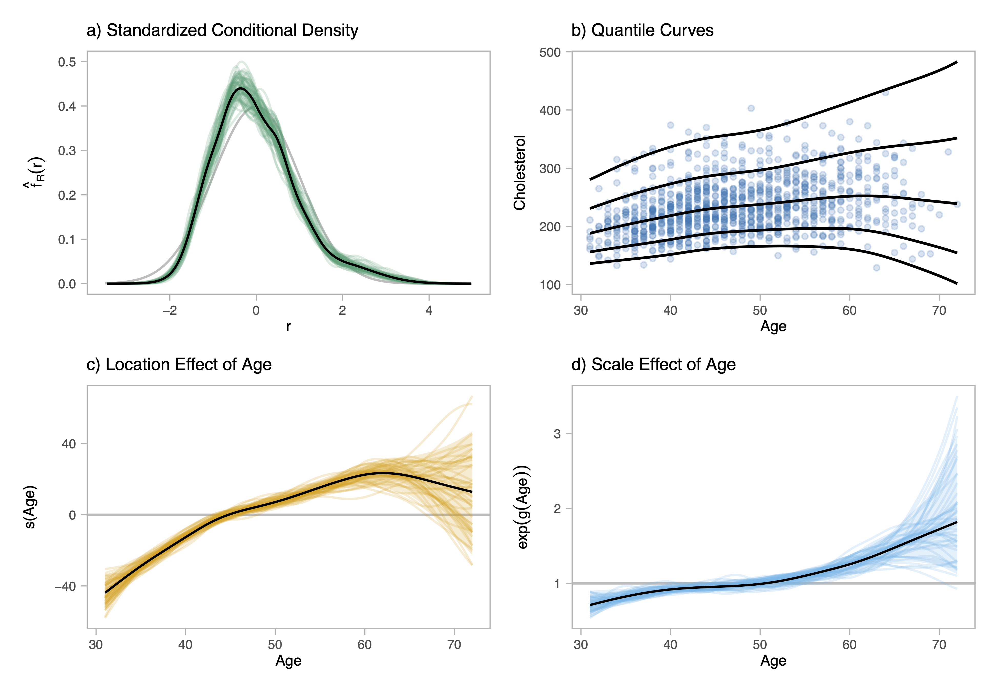

# Supplementary Materials for Bayesian Penalized Transformation Models

This repository contains code and illustrations for the following paper:

Brachem, J., Wiemann, P. F. V., & Kneib, T. (2024). Bayesian penalized transformation models: Structured additive location-scale regression for arbitrary conditional distributions (No. arXiv:2404.07440). arXiv. https://doi.org/10.48550/arXiv.2404.07440

- A Python library for PTMs is available on GitHub: https://github.com/liesel-devs/liesel-ptm 
- Documentation for the library is available via https://liesel-devs.github.io/liesel-ptm/

>Penalized transformation models (PTMs) are a semiparametric location–scale regression
family that estimate a response’s conditional distribution directly from the data, and model
the location and scale through structured additive predictors. The core of the model is a
monotonically increasing transformation function that relates the response distribution to
a reference distribution. The transformation function is equipped with a smoothness prior
that regularizes how much the estimated distribution diverges from the reference. PTMs
can be seen as a bridge between conditional transformation models and generalized additive
models for location, scale and shape. Markov chain Monte Carlo inference for PTMs offers
straightforward uncertainty quantification for the conditional distribution as well as for
the covariate effects.




Figure: Summary of a Penalized Transformation Model for fitting Cholesterol levels. 
Both the average Cholesterol level ("location effect") and the variability of the 
Cholesterol level ("scale effect") are modeled as nonlinear functions of patient age.
The shape of the conditional distribution is estimated semiparametrically from the
data ("standardized conditional density").

## Contents

- `demos/dutch-growth-study.ipynb`: An illustrative jupyter notebook, showcasing the application of a PTM to the fourth dutch growth study.
- `demos/framingham-heart-study.ipynb`: An illustrative jupyter notebook, showcasing the application of a PTM to the fourth dutch growth study.
- `application-dbbmi/` and `application-fh/`: R and Python code for the application comparisons reported in the paper. Instructions for running this code are included at the end of this readme.
- `application-dbbmi/analysis` and `application-fh/analysis`: Data and code for all application-related analyses reported in the paper.


## Setup

To run the demo notebooks, you need the following available:

1. A working installation of Python 3.13 or newer
2. A Python environment, ideally a virtual environment, with the following packages installed:
    - `liesel` development version from the current GitHub main branch
    - `liesel_ptm` from the current GitHub main branch
    - `ipykernel` (for running a jupyter notebook)
    - `jupyter` (for running a jupyter notebook)

Sometimes the installation of Jax, a key dependency of both liesel and liesel_ptm is
tricky. For help, consider: https://docs.jax.dev/en/latest/installation.html

### MacOS Setup

#### Python 3.13

To check you Python version, run the follwing in a terminal:

```
python3.13 --version
```

If that fails, install via Python 3.13 via Homebrew (see https://brew.sh):

```
brew install python@3.13
```

Then verify success by running:

```
python3.13 --version
```

#### Virtual Environment Setup


First, make sure the working directory is the project directory:

```
pwd # prints working directory
```

If that is not the case, change to the project directory

```
cd /path/to/ptm-supplement
```

Now initialize a new virtual environment:

```
python3.13 -m venv .venv
```

Now activate the virtual environment:

```
source .venv/bin/activate
```


#### Install packages

Now install the required packages via:

```
pip install pkg/liesel-0.4.2.dev0.tar.gz
pip install pkg/liesel_ptm-0.1.0.tar.gz
pip install ipykernel jupyter
```

#### Launch Jupyter Notebook

Now you can launch the demo notebooks:

```
jupyter notebook demos/dutch-growth-study.ipynb
```

```
jupyter notebook demos/framingham-heart-study.ipynb
```


### Windows Setup

#### Python 3.13

To check your Python version, open **Command Prompt (cmd.exe)** or **PowerShell** and run:

```
py -3.13 --version
```

If that fails, try:

```
python --version
```

If neither works, download and install Python 3.13 from [python.org](https://www.python.org/downloads/).  
During installation, make sure to check:
- Add python.exe to PATH
- Install py launcher

Then verify success by running again:

```
py -3.13 --version
```


#### Virtual Environment Setup

First, make sure you are in the project directory:

```
cd path\to\ptm-supplement
```

Now initialize a new virtual environment:

```
py -3.13 -m venv .venv
```

Now activate the virtual environment:

```
.venv\Scripts\activate
```

If successful, your prompt will change and show something like:

```
(.venv) C:\path\to\ptm-supplement>
```


#### Install packages

Now install the required packages:

```
pip install pkg/liesel-0.4.2.dev0.tar.gz
pip install pkg/liesel_ptm-0.1.0.tar.gz
pip install ipykernel jupyter
```


#### Launch Jupyter Notebook

Now you can launch the demo notebooks:

```
jupyter notebook demos\dutch-growth-study.ipynb
```

```
jupyter notebook demos\framingham-heart-study.ipynb
```


## Instructions for running application comparison code

- Each application directory contains a subdirectory for each model.
- Each of these directories contains a `launch.py`. This can script can be run to run the comparisons.
- Note that, for most models, `launch.py` is called with `testing=True`, which will run the code with testing settings so that it finishes faster.
- Each `run.R` and `run.py` is written such that it can also be run directly on its own, without going through `launch.py`.


### Reproducible R environment

This project uses `renv` to facilitate reproducibility of R packages. To obtain
a reproducible R environment, please run:

```r
install.packages("renv")
renv::restore()
```

See https://rstudio.github.io/renv/index.html for more information.