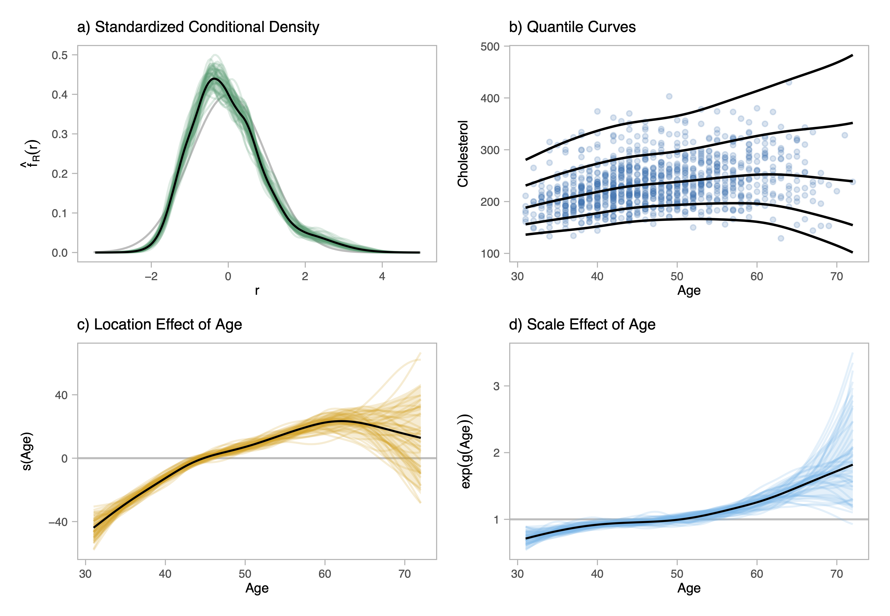

# Supplementary Materials for Bayesian Penalized Transformation Models

This repository contains code and illustrations for the following paper:

Brachem, J., Wiemann, P. F. V., & Kneib, T. (2024). Bayesian penalized transformation models: Structured additive location-scale regression for arbitrary conditional distributions (No. arXiv:2404.07440). arXiv. https://doi.org/10.48550/arXiv.2404.07440

- The Python library for PTMs is available on GitHub: https://github.com/liesel-devs/liesel-ptm 
- Documentation for the library is available via https://liesel-devs.github.io/liesel-ptm/

>Penalized transformation models (PTMs) are a semiparametric location–scale regression
family that estimate a response’s conditional distribution directly from the data, and model
the location and scale through structured additive predictors. The core of the model is a
monotonically increasing transformation function that relates the response distribution to
a reference distribution. The transformation function is equipped with a smoothness prior
that regularizes how much the estimated distribution diverges from the reference. PTMs
can be seen as a bridge between conditional transformation models and generalized additive
models for location, scale and shape. Markov chain Monte Carlo inference for PTMs offers
straightforward uncertainty quantification for the conditional distribution as well as for
the covariate effects.




Figure: Summary of a Penalized Transformation Model for fitting Cholesterol levels. 
Both the average Cholesterol level ("location effect") and the variability of the 
Cholesterol level ("scale effect") are modeled as nonlinear functions of patient age.
The shape of the conditional distribution is estimated semiparametrically from the
data ("standardized conditional density").

## Contents

- `demos/dutch-growth-study.ipynb`: An illustrative jupyter notebook, showcasing the application of a PTM to the fourth dutch growth study.
- `demos/framingham-heart-study.ipynb`: An illustrative jupyter notebook, showcasing the application of a PTM to the fourth dutch growth study.
- `application-dbbmi/` and `application-fh/`: R and Python code for the application comparisons reported in the paper. Instructions for running this code are included at the end of this readme.
- `application-dbbmi/analysis` and `application-fh/analysis`: Data and code for all application-related analyses reported in the paper.
- `sdprior`: Code, data and analysis scripts for the prior predictive simulations carried out for the scale-dependent prior.
- `sim1`: Data and analysis scripts for the preliminary (unconditional) simulation studies reported in the paper. 
- `sim2`: Code, data and analysis scripts for the main simulation study reported in the paper. The synthetic data for this study is available from Zenodo: https://doi.org/10.5281/zenodo.18202553
- `scaling`: Code, data and analysis scripts for experiments on the scaling of runtime with increasing sample sizes reported in Section 4.2 and Figure 7 of the paper.


## Setup

To run the demo notebooks, you need the following setup:

1. A working installation of Python 3.13.x (Python 3.14 is not supported).
2. A working installation of R.

### Install R dependencies

The R dependencies in this project are managed with [`{renv}`](https://rstudio.github.io/renv/articles/renv.html).
In the project root directory, start an interactive R session; renv will then be initialized. Afterwards, install the R dependencies listed in `renv.lock` by running:

```
R> renv::restore()
```

### Install Python dependencies

The Python dependencies in this project are listed in `requirements.txt`. They can be installed by running the following commend in a terminal session in the project root directory:

```
$ pip install -r requirements.txt
```

Sometimes the installation of Jax, a key dependency of both liesel and liesel_ptm is tricky for Windows users. For help, please consider the Jax documentation: https://docs.jax.dev/en/latest/installation.html

## Launch Jupyter Notebooks

Now you can launch and run the demo notebooks:

```
$ jupyter notebook demos/dutch-growth-study.ipynb
```

```
$ jupyter notebook demos/framingham-heart-study.ipynb
```
